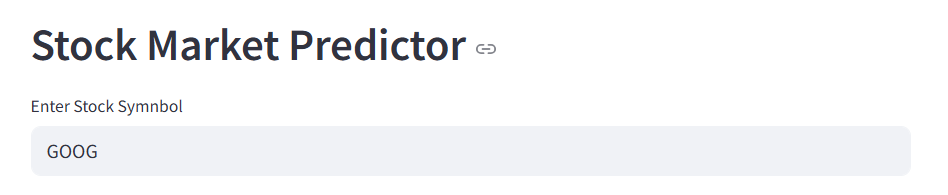
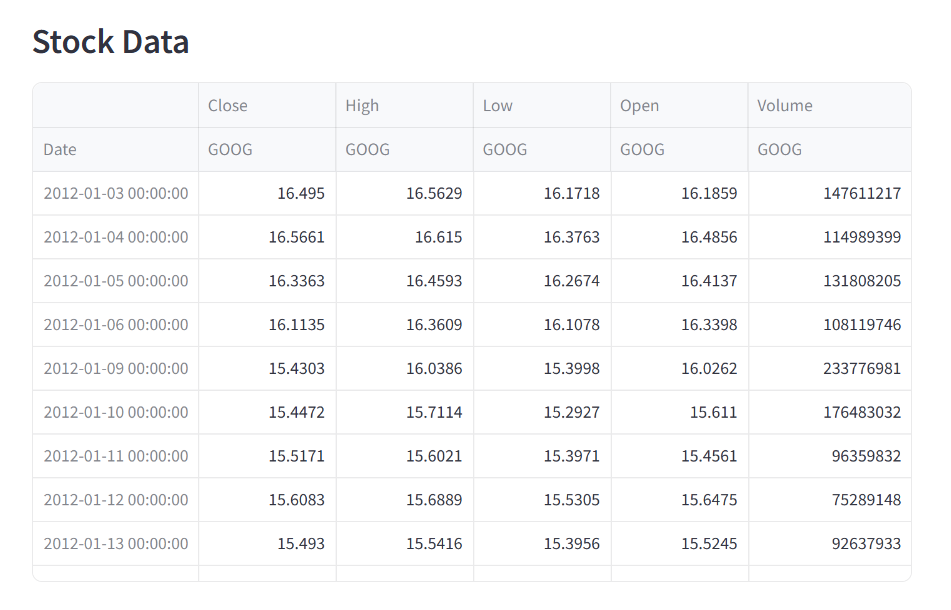
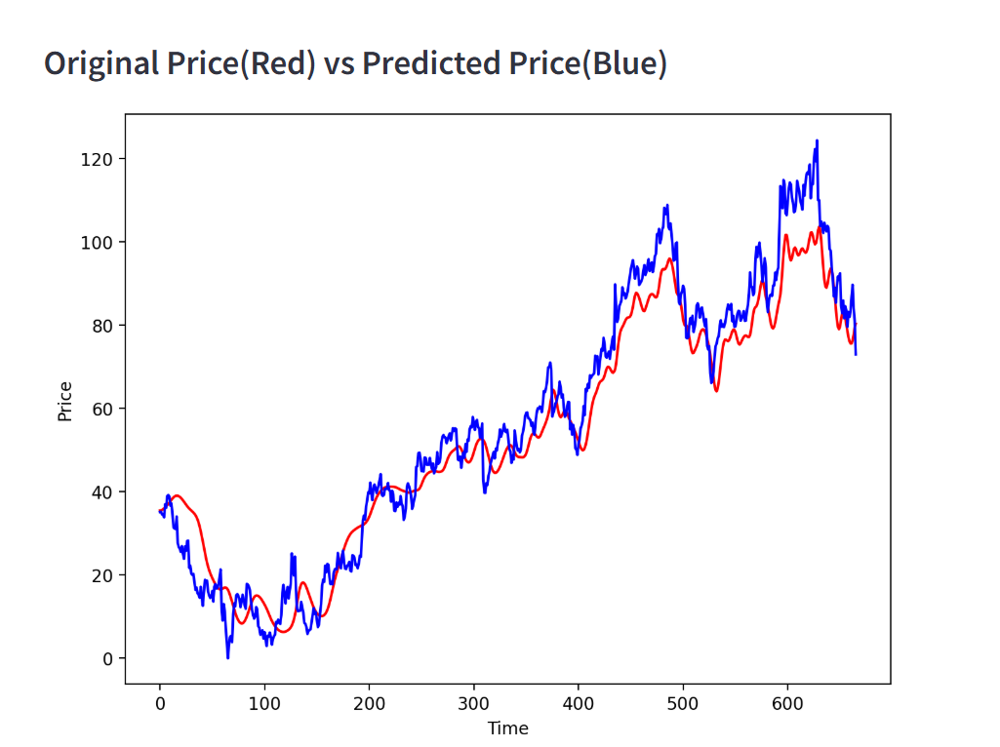

STOCK PRICE ANALYSIS AND PREDICTION MODEL
--> uses streamlit to provide interface
--> uses yfinance to access historical stock market data using yahoo finance

    1.Takes stock ticker as input from user image:
    

    2.Table with data values and relevant attributes using yfinance library
    

    3.Original vs Predicted Price
    
